# KeymapEditor
## GitHubリポジトリのフォーク  
ファームウェアはGitHub Actionsで書き出します。  
1. GitHubアカウントを持っていない場合は、事前に[アカウント登録](https://github.com/signup)をしてください。  
2. 準備が出来たらEnigma_01の[リポジトリ](https://github.com/nazuna293/zmk-config-Enigma_01)をフォークします。  
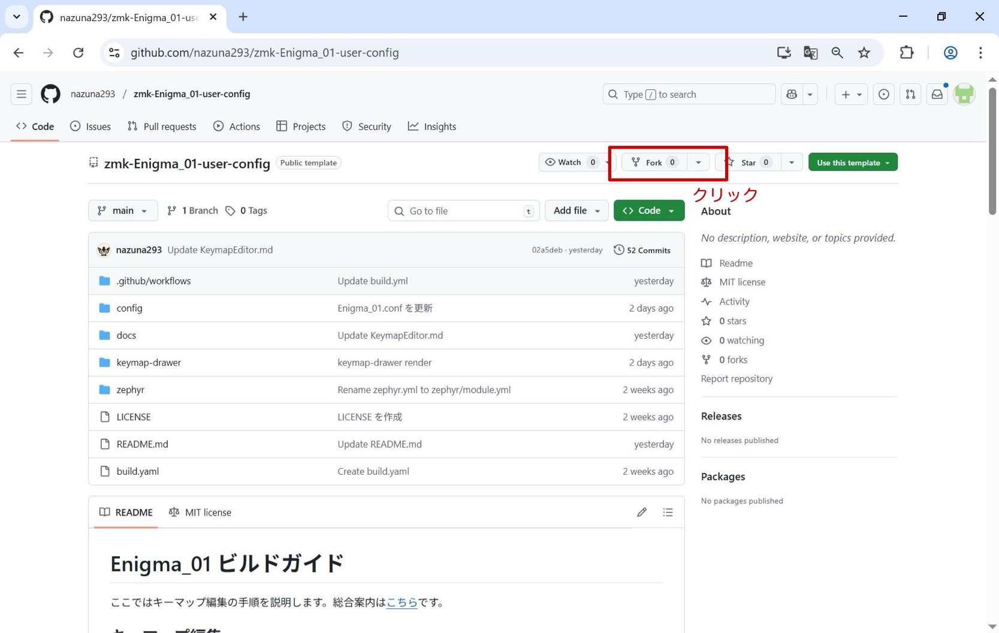
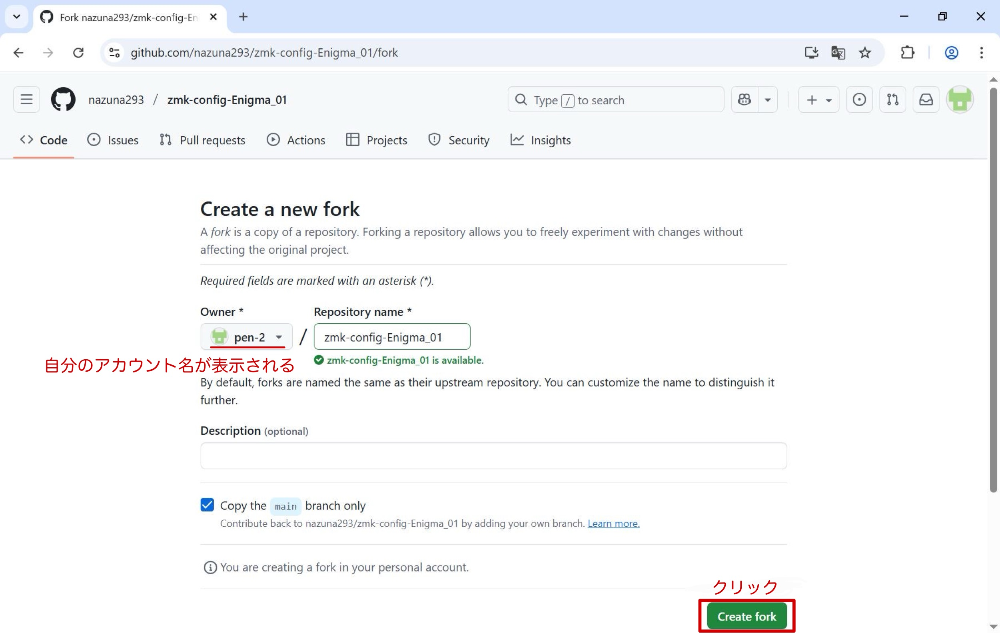
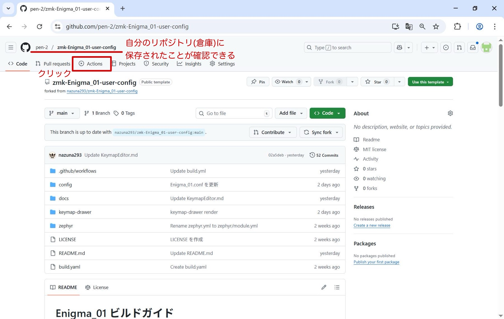
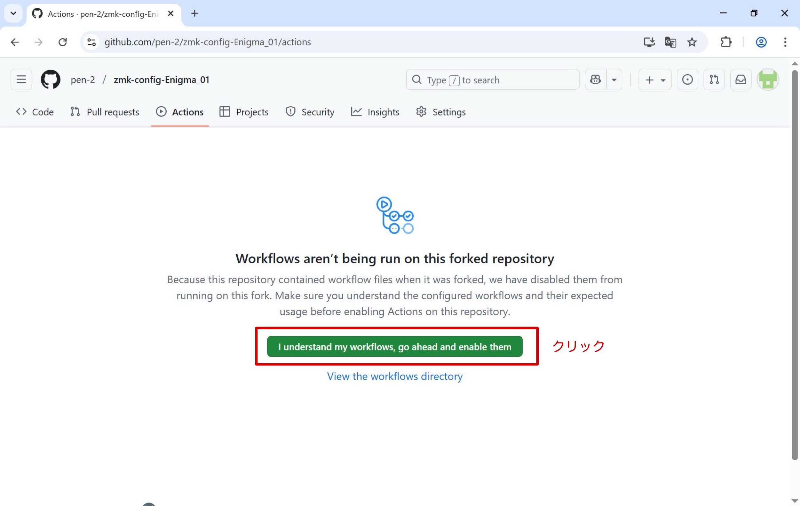

## KeymapEditorと連携
キーマップはブラウザ上で編集します。
1. [KeymapEditor](https://nickcoutsos.github.io/keymap-editor/)にGitHubアカウントを連携させます。  
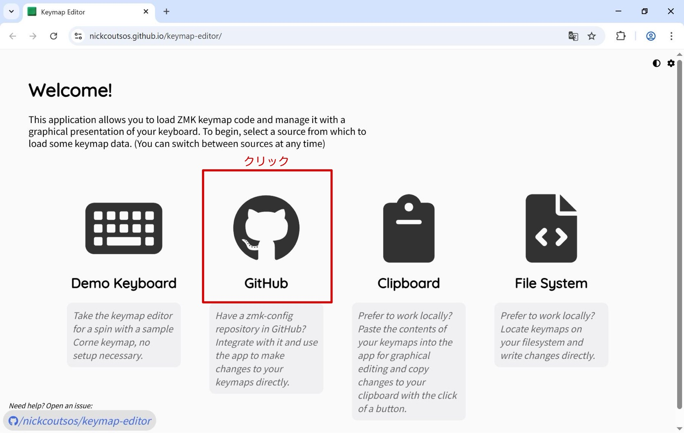
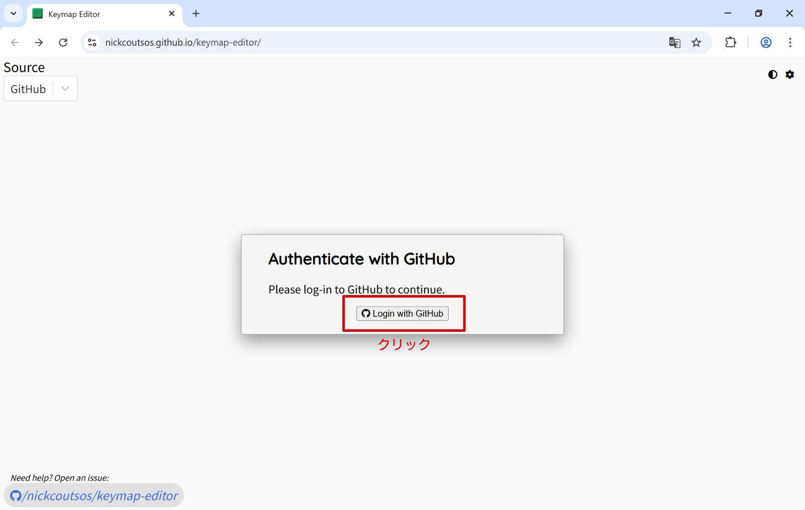
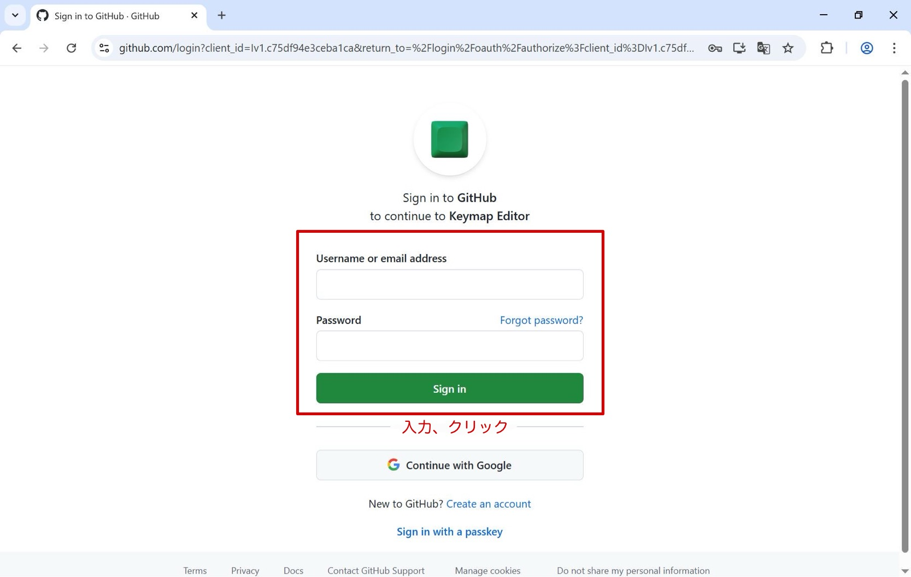
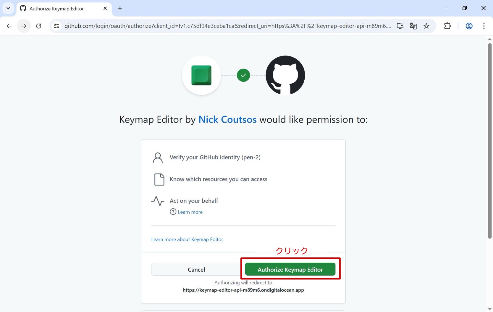
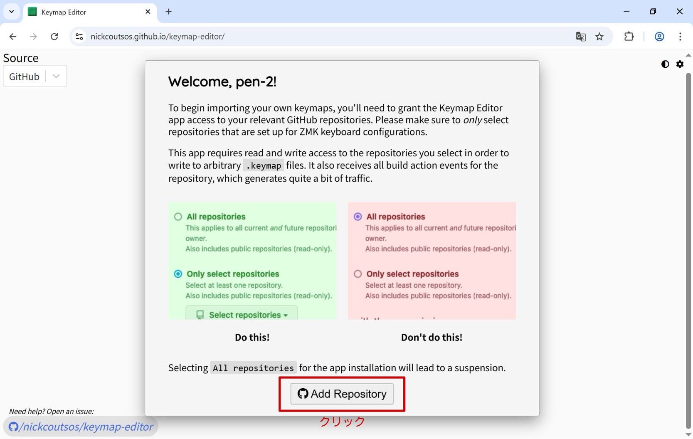
2. zmk-config-Enigma_01を連携させます。  

3. 該当するKeyboard（配列）を選択します。  

|Keyboard|配列|  
|:-|:-|  
|Enigma_01_a|1.0u配列|  
|Enigma_01_b|1.5u配列|  
|Enigma_01_c|2.0u配列|  
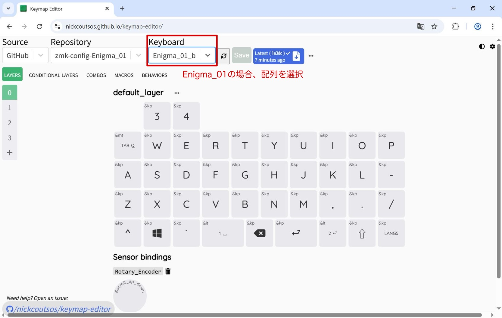

4. キーマップを編集します。  
[Behaviors](https://zmk.dev/docs/keymaps/behaviors)や[Keycodes](https://zmk.dev/docs/keymaps/list-of-keycodes)等のドキュメントに詳細が載っています。  
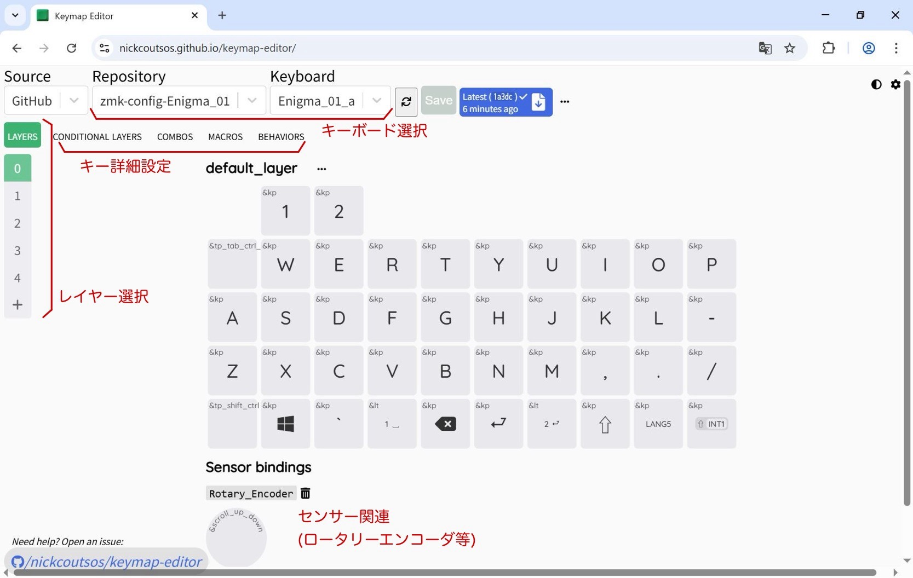

5. キーマップを保存します。
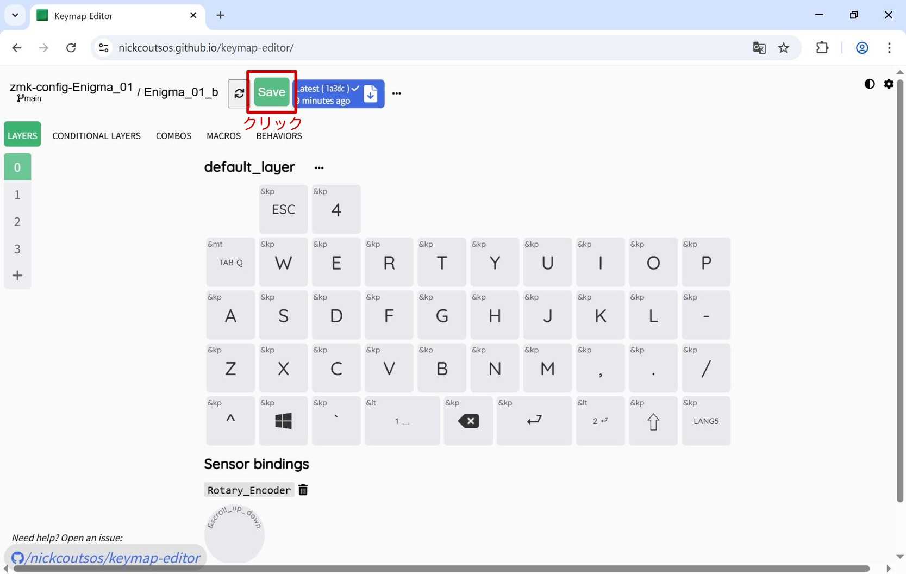
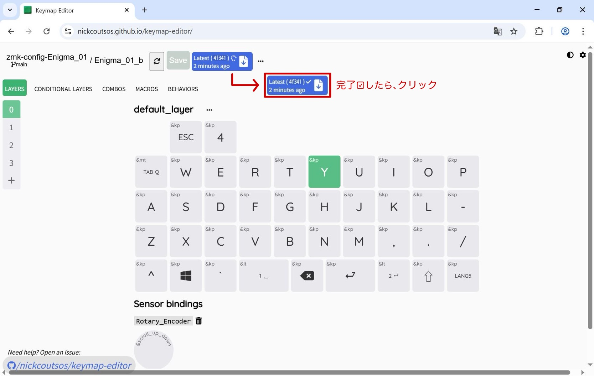

## ファームウェアをEnigma_01へ
以下の手順で転送します。
1. GitHub Actionsからファームウェアをダウンロード、解凍します。

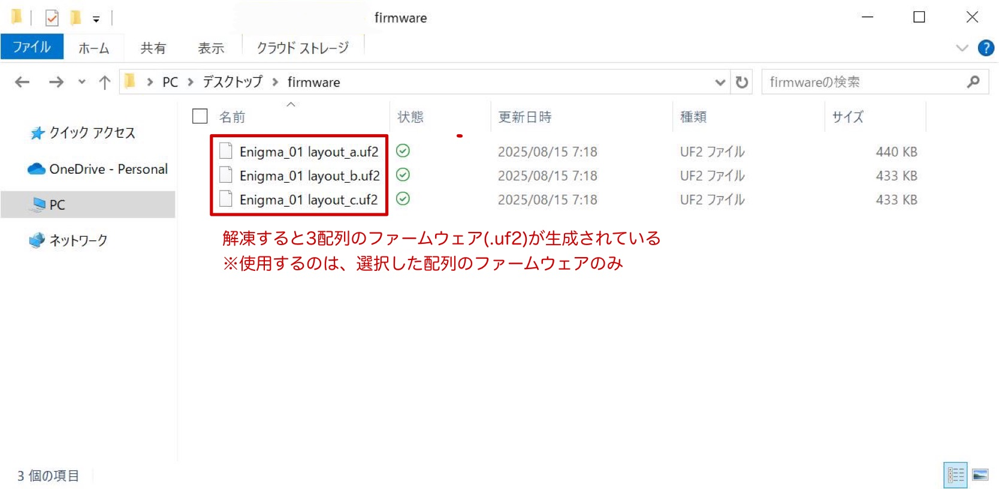

2. Enigma_01とパソコンをUSB-Cケーブルで接続します。

3. 本体のリセットボタンを2回押します。

4. フォルダに「XIAO SENSE」が表示されたらファームウェア(.uf2)を貼り付けます。  

|ファームウェア(.uf2)|配列|  
|:-|:-|  
|Enigma_01 layout_a|1.0u配列|  
|Enigma_01 layout_b|1.5u配列|  
|Enigma_01 layout_c|2.0u配列|  
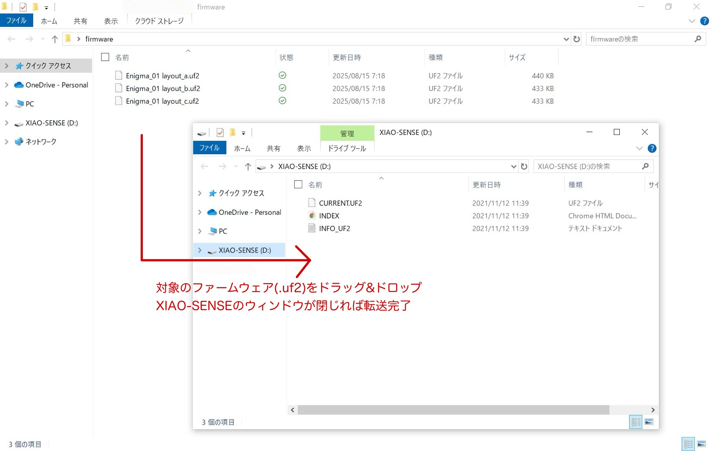

5. Enigma_01の接続が解除、数秒後に復帰します。
