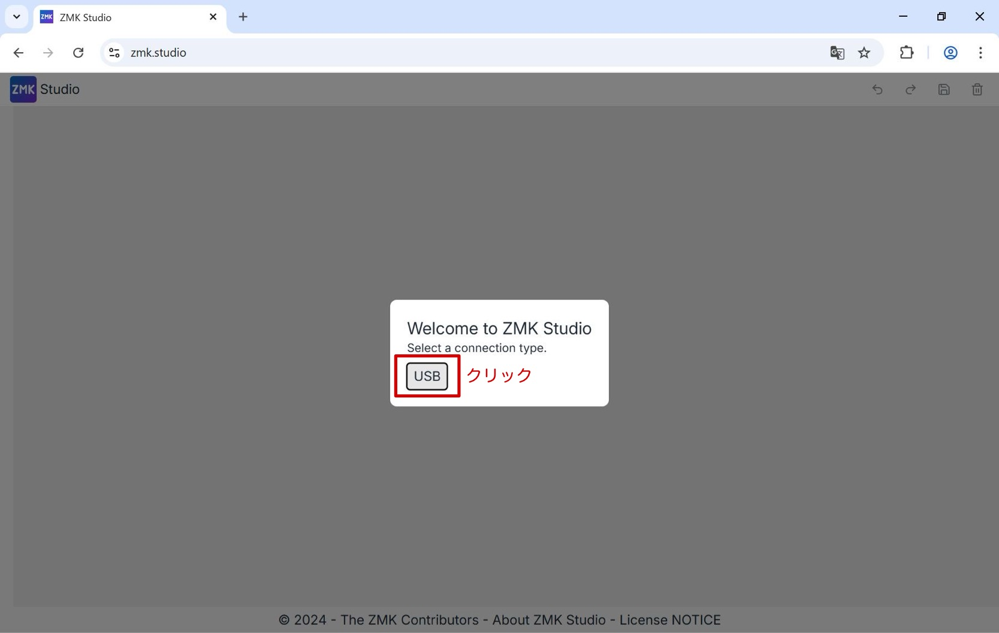
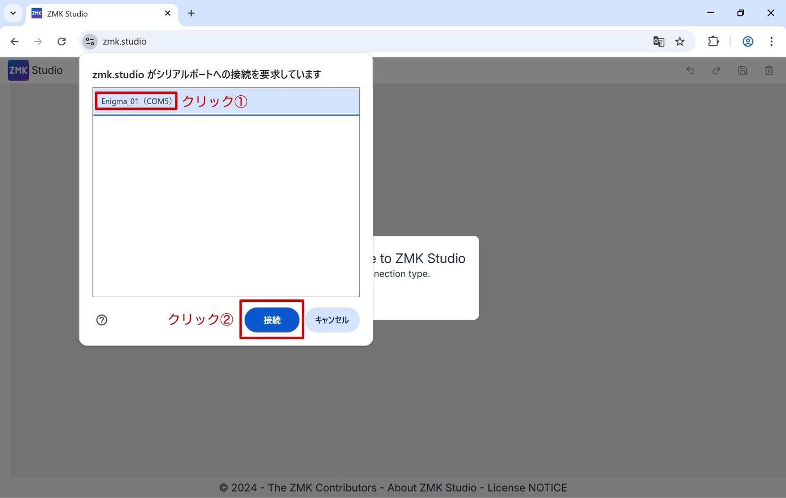
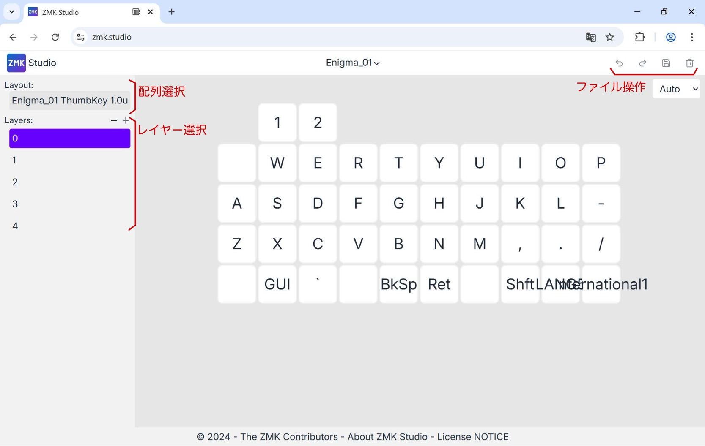
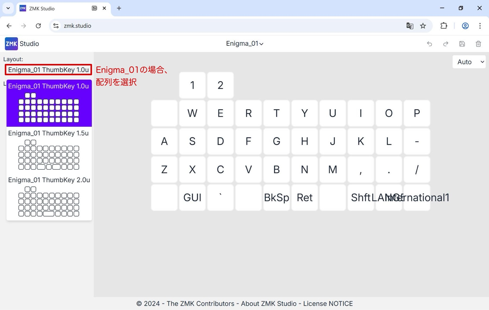
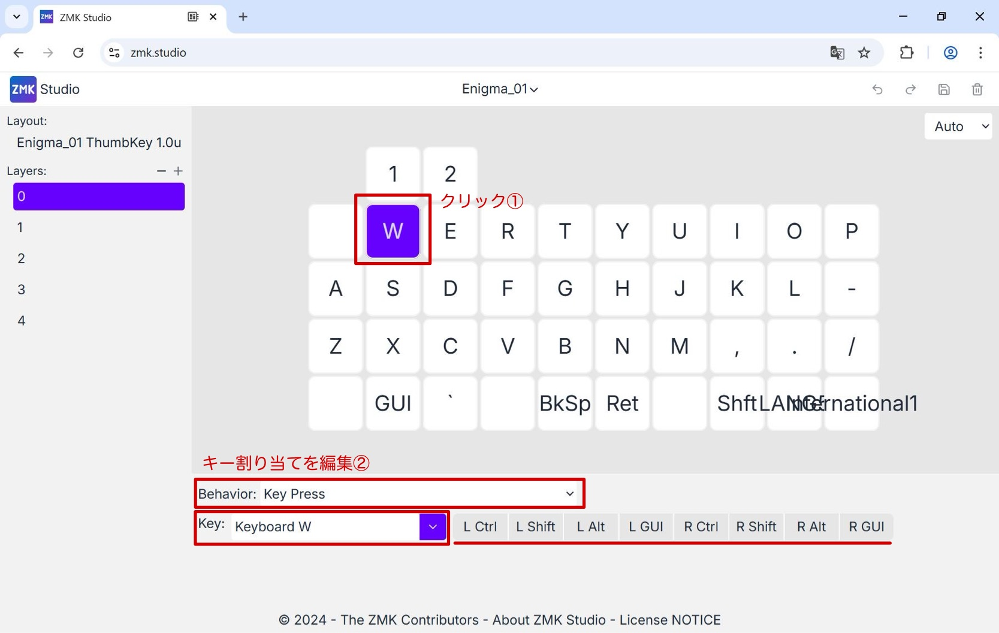
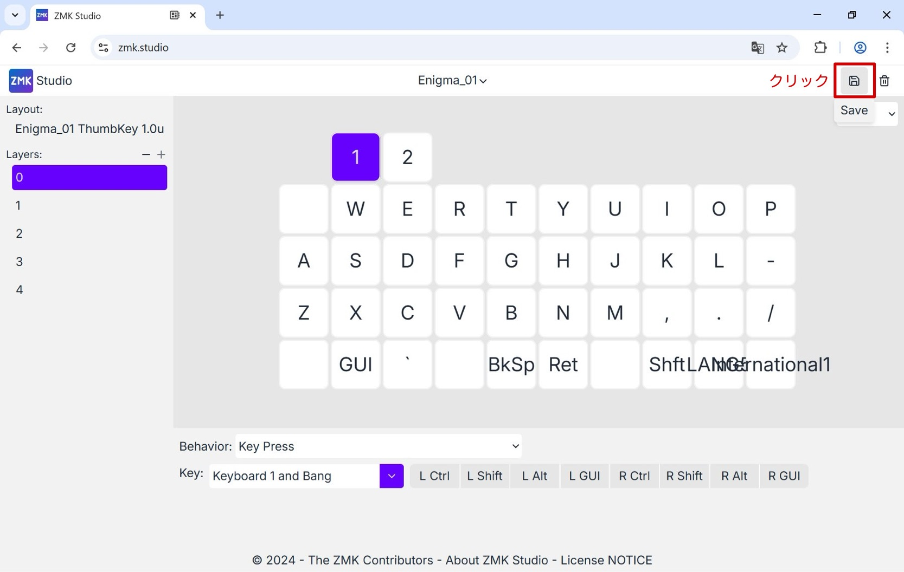
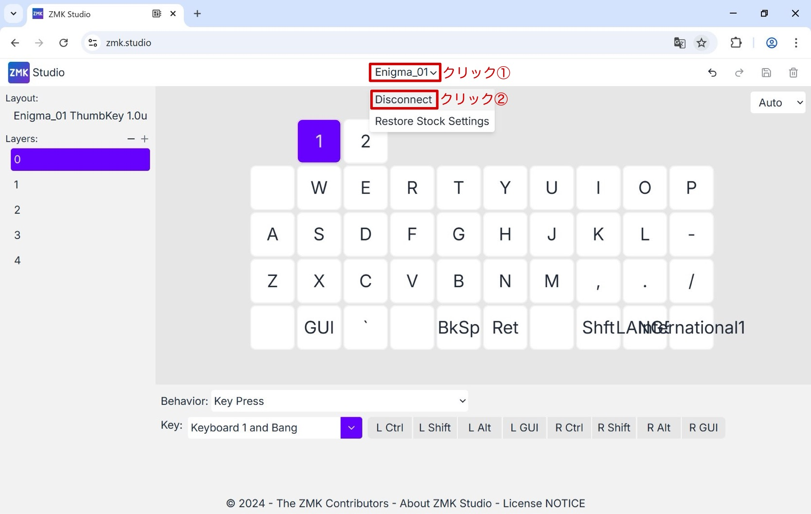

# ZMK Studio
## ブラウザ上で接続
以下の手順で接続しましょう。
1. Enigma_01とパソコンをUSB-Cケーブルで接続します
2. ブラウザ上で[ZMK Studio](https://zmk.studio)を開きます

3. Enigma_01を選択して接続します

## キーマップの編集  
1. ブラウザ上でレイアウトを選択

2. 各キーを選択して編集

3. 編集を保存する

## 接続解除
1. Enigma_01の接続を解除してwebページを閉じる

